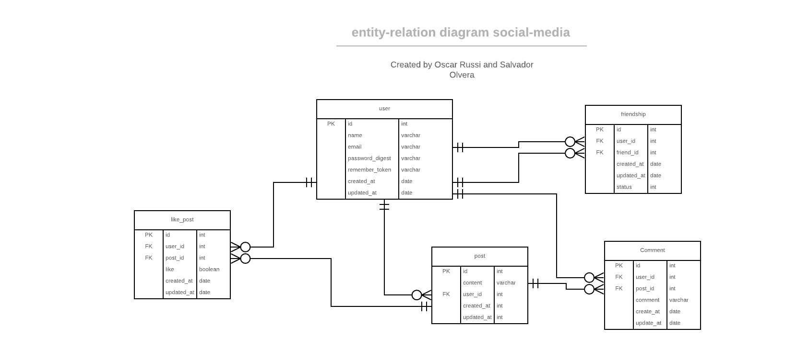

# Private Events project

Eight Ruby on Rails Microverse Project By Salvador Olvera &amp; Oscar Russi

# What it does

- entity-relation model image in the doc folder
- 5 entities: user, friendship, post, like_post and comment
- user has many posts, friendships, like/dislike posts and comments
- friendship has the id of the user who create the friendship invitation and the id of the invited user
- friendship has a status attribute. If pending then is an invitation, if accepted then is a friendship, if rejected no invitation not friendship
- like_post save the user like (or dislike) to a post
- post contains the id of the user who created, also the content of the post   
- comment contains the id of the user and the id of the post

# How to run this project

- Install ruby
- Install ruby on rails
- Install bundle
- Run "bundle install" inside folder
- Run "rails server" inside folder
- Go to http://127.0.0.1:3000/

#### and deployed to GitHub

## Authors

**Salvador Olvera**
- Linkedin: [Salvador Olvera](https://www.linkedin.com/in/salvador-olvera-n)
- Github: [@Salvador-ON](https://github.com/Salvador-ON)
- Twitter: [@Salvador Olvera_ON](https://twitter.com/Salvador_ON) 

**Oscar Russi**
- Github: [@andresporras3423](https://github.com/andresporras3423/)
- Linkedin: [Oscar Russi](https://www.linkedin.com/in/oscar-andr%C3%A9s-russi-porras-053236167/)

## � Contributing

This is a project for educational purposes only. We are not accepting contributions.

## Attributions and Credit

Special thanks to Microverse, for this learning opportunity. 

## Show your support

Give a ⭐️ if you like this project!

## Enjoy!