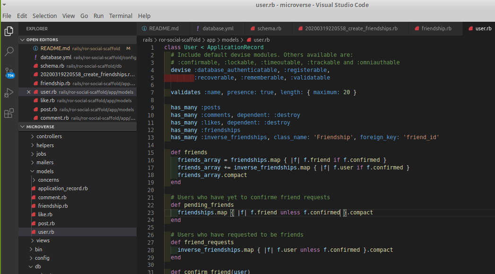

#  Final project ruby on rails - milestone 6

Tenth Ruby on Rails Microverse Project By Salvador Olvera &amp; Oscar Russi

# What it does

- The method save, in friendship model, creates two rows
- using an after_save to create a second record after saving a friendship (using user_id and friend_id in inverse order)
- uniqueness for combination user_id and friend_id

# How to run this project

- Install ruby
- Install ruby on rails
- Install bundle
- Run "bundle install" inside folder
- Run 'rspec' to test the changes on the model

#### and deployed to GitHub

## Authors

**Salvador Olvera**
- Linkedin: [Salvador Olvera](https://www.linkedin.com/in/salvador-olvera-n)
- Github: [@Salvador-ON](https://github.com/Salvador-ON)
- Twitter: [@Salvador Olvera_ON](https://twitter.com/Salvador_ON) 

**Oscar Russi**
- Github: [@andresporras3423](https://github.com/andresporras3423/)
- Linkedin: [Oscar Russi](https://www.linkedin.com/in/oscar-andr%C3%A9s-russi-porras-053236167/)

## � Contributing

This is a project for educational purposes only. We are not accepting contributions.

## Attributions and Credit

Special thanks to Microverse, for this learning opportunity. 

## Show your support

Give a ⭐️ if you like this project!

## Enjoy!